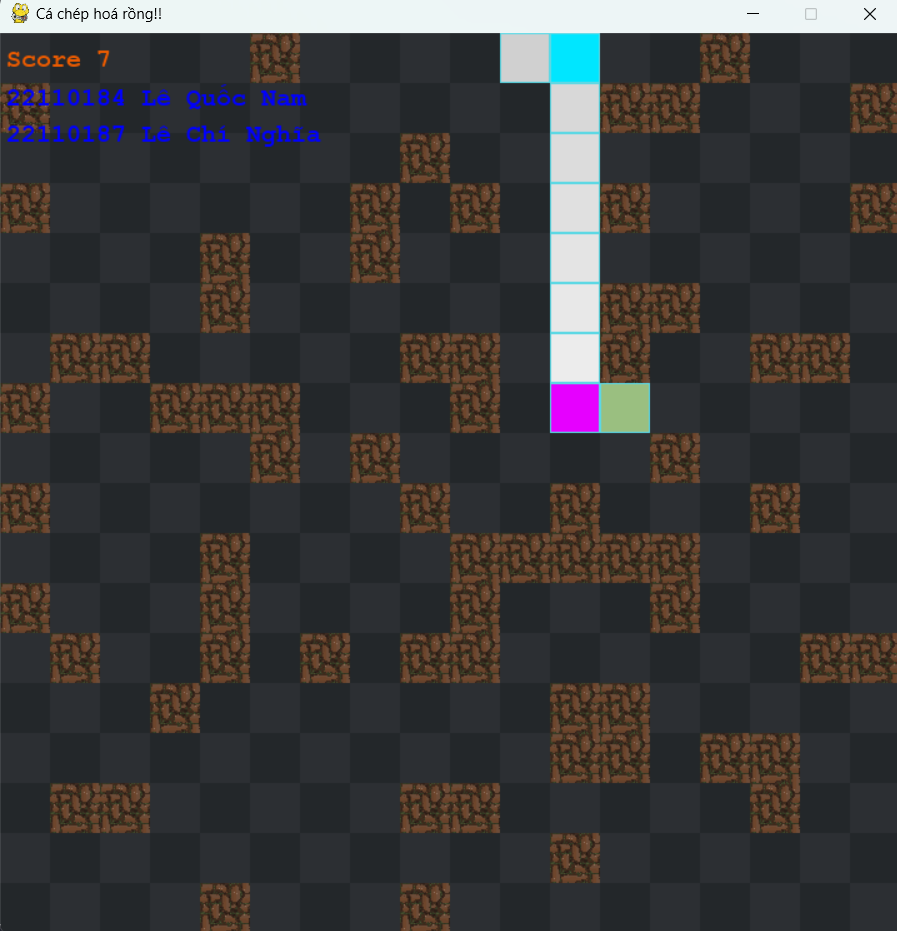

# Cá Chép Hóa Rồng - Game Rắn Săn Mồi với Q-Learning

## Giới thiệu
Dự án "Cá Chép Hóa Rồng" là một phiên bản nâng cao của trò chơi rắn săn mồi cổ điển, được tích hợp với thuật toán học máy Q-Learning. Con rắn trong game sẽ tự học cách di chuyển và săn mồi một cách hiệu quả thông qua quá trình huấn luyện.

## Tính năng
- Thuật toán Q-Learning cho phép rắn tự học và cải thiện chiến lược chơi
- Hệ thống lưu trữ và tải Q-table tốt nhất
- Giao diện trực quan với pygame
- Chướng ngại vật ngẫu nhiên tăng độ khó cho game
- Hiển thị điểm số và thông tin trạng thái

## Cài đặt
```
git clone https://github.com/zerrorTwo/CaChepHoaRongg.git
pip install -r requirements.txt
```
## Cách chạy game với 4 thuật toán
```
python main.py
```
# Cách chạy Q-Learning
```
python -m src.q_learning.train
```

## Cấu trúc project
```
cachephoarong/
├── src/
│ ├── q_learning/
│ │ ├── models/ # Thư mục chứa các Q-table đã huấn luyện
│ │ └── qlearning.py # Implement thuật toán Q-Learning
│ ├── constants.py # Các hằng số của game
│ ├── game.py # Logic game chính
│ └── main.py # File khởi chạy chương trình
└── README.md
```

## Link tham khảo
```
https://stackoverflow.com/questions/69585685/dfs-snake-solving-algorithm-nonetype-object-has-no-len
https://www.youtube.com/watch?v=97gDXdA7kVc&t=2950s
```
## GUI giao diện

- Nhấn bất kỳ phím nào để bắt đầu game
- Nhấn phím `ESC` để pause game

## Giao diện khi chơi


## Giao diện khi pause


## Giao diện khi game over


## Hình ảnh thực tế

